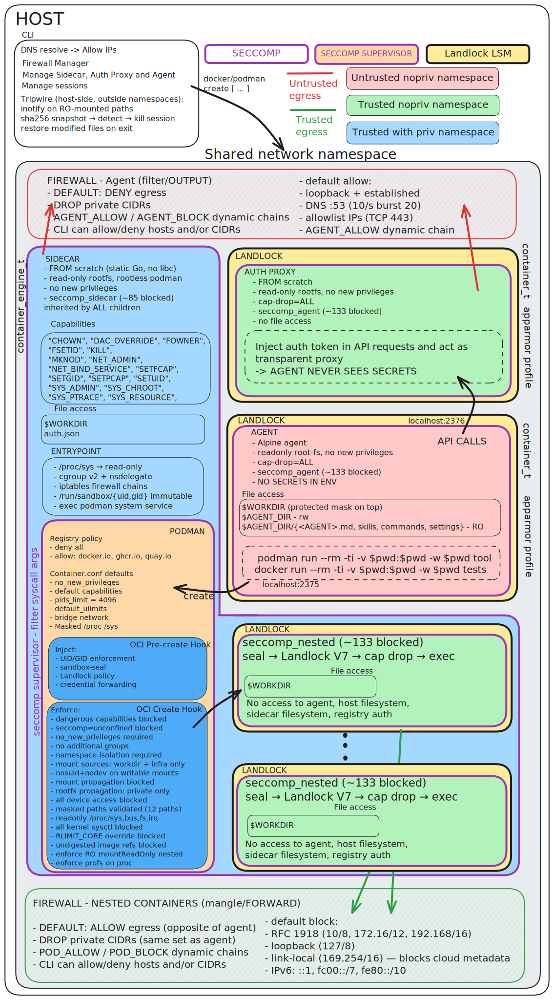

<!-- SPDX-License-Identifier: GPL-3.0-only -->

# Clampdown

<p align="center"></p>

Run AI coding agents in hardened container sandboxes.

AI coding agents run arbitrary code on your machine. clampdown confines them to a
hardened container sandbox: filesystem access is restricted to your project, network
egress is limited to the APIs the agent needs, and every tool container the agent
spawns gets the same enforcement.



> **Blue** = sidecar. **Yellow** = agent. **Green** = tool containers.
> **Red text** = untrusted egress. **Green text** = trusted egress.
> **Border color** = namespace trust level (see legend in diagram).

---

## Container overview

clampdown runs four container types with different privilege levels:

| | Sidecar | Auth Proxy | Agent | Tool (nested) |
|---|---|---|---|---|
| Purpose | Container runtime + firewall | API key injection | AI agent process | Tools the agent spawns |
| Base image | `FROM scratch` (no shell, no libc) | `FROM scratch` | Alpine | User-chosen |
| Capabilities | 16 (`SYS_ADMIN`, `NET_ADMIN`, ...) | 0 (`cap-drop=ALL`) | 0 (`cap-drop=ALL`) | 10 default (effective set empty) |
| Seccomp | ~100 blocked | ~150 blocked | ~150 blocked | ~150 blocked + inherited sidecar |
| Landlock | No (incompatible with `mount()`) | RO rootfs, TCP 443+53 only | workdir RW, rootfs RO | Derived from bind mounts |
| Secrets | Registry credentials (opt-in) | Real API keys | None (`sk-proxy` dummy key) | None |
| Network egress | N/A | TCP 443, 53 (Landlock) | Deny + allowlist only | Allow, private CIDRs blocked |
| Rootfs | Read-only | Read-only | Read-only | Read-only |
| Runs as | root (userns-mapped) | Non-root | Non-root | Non-root (hook-enforced) |
| SELinux | `container_engine_t` | `container_t` | `container_t` | `container_t` |
| AppArmor | unconfined | confined | confined | confined |
| Core dumps | Allowed | Disabled (`ulimit core=0:0`) | Disabled | Allowed |

- The sidecar is privileged enough to run podman and enforce firewall rules, but has no
  shell and no libc so it cannot be repurposed. Uses native kernel overlay (no /dev/fuse).
  A seccomp-notif supervisor intercepts 20 syscalls in real time -- blocking unmounts of
  masked paths, bind mounts from unauthorized sources (container-ID-scoped allowlist),
  execution of unknown binaries, deletion of protected files, and unauthorized firewall
  modification -- closing the gap where Landlock cannot be applied. Sensitive /proc and
  /sys paths are masked with /dev/null across all containers.
- The auth proxy holds the only copy of real API keys. It runs in a `FROM scratch`
  container with no shell, no writable filesystem, no capabilities, and core dumps
  disabled. The agent gets a dummy key (`sk-proxy`) and a base URL pointing at the
  proxy. Even direct connections to the upstream API produce a 401.
- Tool containers have open egress to the public internet but hold no secrets:
  they cannot reach private networks, and credentials are never forwarded unless explicitly opted in.

---

## Threat model

clampdown treats the agent as an untrusted process. Not because current models are
malicious, but because the attack surface is real: prompt injection can hijack an
agent's actions, jailbreaks can override its instructions, and even well-behaved
models run arbitrary code that may do things you didn't ask for. If the agent can
`curl`, `cat ~/.ssh`, or `podman run --privileged`, the question is when -- not
whether -- something goes wrong.

Every defense in clampdown enforces from outside the agent's process. Filesystem
restrictions are kernel-level Landlock rulesets applied before the agent binary starts.
Network policy is iptables chains installed by the sidecar, in a network namespace the
agent shares but cannot configure. Seccomp profiles are inherited from the container
runtime -- the agent cannot modify or remove them. OCI hooks validate every container
the agent creates before its entrypoint runs, and there is no flag to skip them.

None of these controls depend on the agent cooperating. A fully compromised agent --
one that ignores its system prompt entirely and tries to escape -- hits the same
kernel-enforced walls as one following instructions. That's the point.

---

## Security model

### Nested container enforcement

The agent runs inside a zero-capability container: `cap-drop=ALL`, read-only rootfs,
`no-new-privileges`, and a seccomp profile that blocks ~150 syscalls including all
known kernel exploit primitives (io_uring, userfaultfd, BPF, perf_event, splice/tee,
memfd_create), all namespace creation flags, all filesystem-admin ioctls, and
mount enumeration syscalls.
When the agent needs to run a tool -- a compiler, a test runner, a shell command -- it
sends a `podman run` request to the sidecar's API socket. The sidecar intercepts every
container creation through two OCI hooks that run synchronously before the container
process starts:

**precreate** (`seal-inject`): rewrites the container entrypoint to `sandbox-seal`,
which applies Landlock and cleans up unsafe file descriptors before execing the real
command. The hook also assigns a non-root UID mapped outside the container's user
namespace, mounts `hidepid=2` on `/proc`, and injects masked paths over sensitive
kernel interfaces (`/proc/kcore`, `/proc/sysrq-trigger`, and nine others).

**createRuntime** (`security-policy`): validates the final OCI config against 17
security checks -- blocking privileged mode, disallowed capabilities, host namespace
sharing, unsafe bind mounts (container-ID-scoped infrastructure allowlist), dangerous
devices, RW re-mounts of protected paths, /proc mount type, supplementary groups,
and seccomp profile integrity (rules must match the canonical profile).
A container that fails any check is killed before its entrypoint runs.

Both hooks apply to every `podman run` the agent issues. There is no opt-out.

### Sidecar supervisor

The sidecar cannot use Landlock (mount() internally triggers Landlock path hooks).
To compensate, the sidecar entrypoint installs a seccomp-notif BPF filter that
intercepts 20 syscalls covering mount operations (with container-ID-scoped bind
source allowlist and validated named volume paths), exec verification, protected-path
file operations, process targeting, and firewall modification. A supervisor goroutine
evaluates each call against policy and either continues the syscall or blocks it.

This blocks attempts to unmount masked paths (exposing `.env` contents), remount
protected paths read-write, create a new procfs to access `/proc/1/mem`, execute
binaries not present on the rootfs at startup (SHA-256 hash-verified allowlist),
delete or replace protected files, modify iptables rules, or use ptrace to read
the supervisor's memory. Legitimate operations (podman creating containers, netavark
configuring bridge rules) pass through unimpeded.

The **exec allowlist** walks the rootfs at startup and SHA-256 hashes every
executable. On each execve/execveat from sidecar PID namespace processes, the
supervisor verifies the binary against the startup snapshot. Unknown binaries are
blocked with EACCES. Nested container processes (different PID namespace) skip the
check -- their exec is governed by Landlock and the workload seccomp profile.

The **firewall lock** blocks netfilter socket creation and iptables rule replacement
except from the netavark->xtables-nft-multi chain (podman's network manager). Since
`podman exec` from the host enters via setns (not fork), it does not inherit the
filter -- legitimate firewall changes from the launcher are exempt.

The filter is inherited by all processes in the sidecar. For agent and nested
containers, the workload seccomp profile already blocks mount/umount entirely
(stricter than the supervisor's USER_NOTIF), so the supervisor effectively only
handles sidecar-level operations.

### Landlock filesystem isolation

[Landlock](https://landlock.io/) is a Linux kernel LSM that enforces filesystem
access control at the kernel level, beneath and independent of container bind mounts
and Unix permission bits.

`sandbox-seal` applies a Landlock ruleset inside the agent process just before it
execs the agent binary. The rules cannot be lifted after exec -- Landlock policies are
inherited across exec and can only be made more restrictive, never relaxed.

Agent policy:
- **Read-write + execute**: your working directory (the project being edited)
- **Read + execute**: system directories (`/usr`, `/bin`, `/lib`, `/etc`, ...)
- **No access**: everything else -- host home, other projects, sensitive kernel paths

Tool containers launched by the agent get a derived policy based on their mount list:
writable access is granted only to paths explicitly bind-mounted into the container.

Landlock V3 (kernel >= 6.2) is a hard requirement. The launcher refuses to start if
Landlock is absent. Kernel >= 6.12 is recommended for full feature coverage (V4 TCP
connect at 6.7, V5 IoctlDev at 6.10, V6 IPC scoping at 6.12). V7 audit logging
requires 6.15+.

### API key isolation

The agent never receives real API credentials. A separate auth proxy container
holds the real keys and injects them into upstream requests.

```
Agent (sk-proxy) ──> Auth Proxy (real key) ──> Upstream API
```

The proxy runs in its own `FROM scratch` container: no shell, no writable
filesystem, no capabilities (`cap-drop=ALL`), core dumps disabled, Landlock
restricting TCP to ports 443 and 53 only. Even if the agent connects to the
upstream API directly (port 443 is allowed for infrastructure domains), it
sends the dummy key `sk-proxy` and gets a 401.

Keys are resolved from two sources -- the host environment and `.clampdownrc`.
Neither is forwarded into the agent container. The proxy logs every API request
(method, path, status, model, sizes, duration) for the audit trail.

### Network isolation

The agent container shares the sidecar's network namespace. All egress is controlled
by iptables rules the sidecar installs at startup -- not by application-layer filtering
that the agent could bypass.

**Agent (default: deny)**: outbound connections are blocked except for an explicit
allowlist of domains required by the agent (API endpoints, auth, telemetry). The
allowlist is resolved to IPs at session startup and installed as iptables ACCEPT rules.
DNS queries are rate-limited to 10 requests per second.

**Tool containers (default: allow)**: outbound is open to the public internet, but all
RFC 1918 addresses, loopback, link-local, and IPv6 ULA ranges are permanently blocked.
Tool containers cannot reach the host, the sidecar, or other containers by internal IP.

Private CIDRs are blocked for both the agent and tool containers regardless of policy.
Both defaults are configurable (`--agent-policy`, `--pod-policy`), and rules can be
adjusted at runtime without restarting the session -- see
[Runtime network control](#runtime-network-control).

For the full technical reference -- seccomp profile tables, iptables chains, Landlock
access sets, capability lists, OCI hook pipeline, and masked path inventory -- see
[DIAGRAM.md](DIAGRAM.md).

---

## Requirements

| Requirement | Version | Notes |
|-------------|---------|-------|
| Linux kernel | >= 6.2 | Hard requirement (Landlock V3). Runs natively or in a VM (see below). |
| Kernel | >= 6.12 | Recommended. V4 TCP connect (6.7), V5 IoctlDev (6.10), V6 IPC scoping (6.12). V7 audit logging (6.15). |
| Container runtime | any recent | rootless podman (preferred), Docker, or nerdctl |
| Go | >= 1.23 | Build-time only |

### Platform support

| Platform | Runtime | Status |
|----------|---------|--------|
| Linux (native) | podman, docker | Full support. All security layers active. |
| Linux / macOS | podman machine | Full support. Containers run in a Linux VM with full Landlock. |
| Linux / macOS | docker + colima | Full support. Containers run in a Linux VM with full Landlock. |
| macOS | Docker Desktop | **Not supported.** Its `fakeowner` filesystem breaks Landlock enforcement. |

VM backends (podman machine, colima) run containers inside a Linux VM.
All security layers (Landlock, seccomp, iptables, OCI hooks) execute
inside the VM kernel, identical to native Linux. The VM boundary adds
an extra isolation layer — a kernel exploit inside the VM cannot reach
the host.

```sh
# podman machine (any platform)
podman machine start

# colima + docker (Linux / macOS)
colima start
docker context use colima
```

Verify Landlock is active (Linux or inside the VM):

```sh
cat /sys/kernel/security/lsm   # must contain "landlock"
```

---

## Install

```sh
git clone https://github.com/89luca89/clampdown
cd clampdown
make all      # builds sidecar image, agent images, and launcher binary
make install  # copies binary to ~/.local/bin/clampdown
```

`make all` builds five container images (`clampdown-sidecar`, `clampdown-proxy`,
`clampdown-claude`, `clampdown-codex`, `clampdown-opencode`) and the `clampdown`
launcher binary. Images are rebuilt only when their source changes (stamp files).

---

## Quick start

Store API keys in `~/.config/clampdown/clampdownrc` (created once, used by all sessions):

```sh
# ~/.config/clampdown/clampdownrc
ANTHROPIC_API_KEY=sk-ant-...
OPENAI_API_KEY=...
```

Per-project overrides go in `.clampdownrc` at the root of each project. Project values
take precedence over the global file:

```sh
# /path/to/project/.clampdownrc
ANTHROPIC_API_KEY=sk-ant-...   # project-specific key
```

Then run:

```sh
clampdown claude

# OpenCode (supports multiple providers)
clampdown opencode

# Codex (OpenAI API key or ChatGPT subscription auth)
clampdown codex

# Run against a specific directory (defaults to $PWD)
clampdown claude --workdir /path/to/project

# Pass flags through to the agent
clampdown claude -- --model claude-opus-4-5
```

Alternatively, pass keys via environment:

```sh
ANTHROPIC_API_KEY=sk-ant-... clampdown claude
```

The first run pulls base images and builds a per-project container storage cache under
`~/.cache/clampdown/`. Subsequent runs start faster.

---

## Agents

| Agent | Command | Supported provider keys |
|-------|---------|------------------------|
| Claude Code | `clampdown claude` | `ANTHROPIC_API_KEY` |
| OpenAI Codex | `clampdown codex` | `OPENAI_API_KEY`, or ChatGPT subscription auth copied from `~/.codex/auth.json` |
| OpenCode | `clampdown opencode` | `ANTHROPIC_API_KEY`, `OPENAI_API_KEY`, `GOOGLE_GENERATIVE_AI_API_KEY`, `GEMINI_API_KEY`, `GROQ_API_KEY`, `DEEPSEEK_API_KEY`, `MISTRAL_API_KEY`, `XAI_API_KEY`, `OPENROUTER_API_KEY`, `OPENCODE_API_KEY` |

Keys are passed to the auth proxy, not the agent. The first matching key (from host
environment or `.clampdownrc`) activates the proxy for that provider. The agent
receives a dummy key (`sk-proxy`) and a base URL pointing at the local proxy.

---

## Options

All options can be set on the CLI, in `config.json`, or (for environment-variable-mapped
options) via env.

```
clampdown [options] <agent> [-- agent-flags...]
```

### Network

| Flag | Default | Env | Description |
|------|---------|-----|-------------|
| `--agent-policy` | `deny` | `SANDBOX_AGENT_POLICY` | Agent egress default: `deny` (allowlist only) or `allow` |
| `--agent-allow` | -- | `SANDBOX_AGENT_ALLOW` | Extra domains for the agent allowlist (comma-separated) |
| `--pod-policy` | `allow` | `SANDBOX_POD_POLICY` | Tool container egress default: `allow` or `deny` |

The agent's egress allowlist includes the domains required by the agent (API endpoints,
auth, telemetry). Private CIDRs (RFC 1918, loopback, link-local, IPv6 ULA) are always
blocked for both agent and tool containers, regardless of policy.

### Filesystem

| Flag | Default | Description |
|------|---------|-------------|
| `--allow-hooks` | off | Allow agent to modify `.git/hooks/` (read-only by default) |
| `--protect` | -- | Additional paths to protect read-only (repeatable; trailing `/` = directory) |
| `--mask` | -- | Additional paths to mask - prevent read (repeatable; trailing `/` = directory) |
| `--unmask` | -- | Remove paths from the default mask list (e.g. `--unmask .env`) |

Protected paths are always read-only inside the agent and nested containers, regardless
of flags: `.git/config`, `.git/hooks`, `.gitmodules`, `.claude`, `.codex`,
`.devcontainer`, `.idea`, `.mcp.json`. User `--protect` paths get the same enforcement.
Protected paths propagate into nested containers via recursive bind mounts; explicit
RW re-mounts are blocked by the security-policy hook.

Masked paths are hidden entirely (replaced with `/dev/null`): `.env`, `.envrc`, `.npmrc`,
`.clampdownrc`. The agent sees the path exists but reads empty content.

Use `--unmask` to selectively restore access (e.g. `--unmask .env` for projects
that need it). Persistent via `config.json`: `{"unmask_paths": [".env"]}`.

### Resources

| Flag | Default | Env | Description |
|------|---------|-----|-------------|
| `--memory` | `4g` | `SANDBOX_MEMORY` | Memory limit for agent and tool containers |
| `--cpus` | `4` | `SANDBOX_CPUS` | CPU limit |

### Credentials

Credentials are opt-in. Nothing is forwarded by default.

| Flag | Description |
|------|-------------|
| `--gitconfig` | Forward `~/.gitconfig` read-only into tool containers |
| `--gh` | Forward `~/.config/gh` read-only into tool containers (GitHub CLI auth) |
| `--ssh` | Forward `SSH_AUTH_SOCK` into tool containers |

### Registry

| Flag | Default | Env | Description |
|------|---------|-----|-------------|
| `--registry-auth` | off | `SANDBOX_REGISTRY_AUTH` | Forward host registry credentials to the agent |
| `--require-digest` | `warn` | `SANDBOX_REQUIRE_DIGEST` | Image digest enforcement: `warn` or `block` |

### Other

| Flag | Default | Description |
|------|---------|-------------|
| `--runtime` | auto | Container runtime: `podman`, `docker`, `nerdctl` |
| `--tripwire` | off | Kill session on protected path modification (restores on exit either way) |
| `--log-level` | `info` | `debug`, `info`, `warn`, `error` |

**Tripwire** monitors protected host paths via inotify and kills the session
immediately if any are modified -- the last line of defense against a full
container escape. It also snapshots files before launch and restores them on
exit (restoration happens regardless of the flag).

Off by default because IDEs, other terminal sessions, and git operations
in the same workdir trigger false positives. Enable it for high-security
use cases where the workdir is not touched by anything else during the session:

```sh
clampdown claude --tripwire
```

---

## Session management

All containers run detached. `clampdown claude` starts a session and attaches
to it. Detach with `ctrl+]` — the session keeps running in the background.
All containers use `--restart=unless-stopped`: if the agent crashes, it
restarts automatically. Only `clampdown stop` stops a session.

```sh
# Start a session and attach (default workflow)
clampdown claude

# Detach: press ctrl+]
# The session keeps running. The launcher exits.

# List all sessions (running and stopped)
clampdown list

# Reattach to a running session
clampdown attach -s <session-id>

# Stop a running session (all containers)
clampdown stop -s <session-id>

# Remove a stopped session's containers and temp files
clampdown delete -s <session-id>

# View audit events from a session (merged, sorted)
clampdown logs -s <session-id>

# Remove all cached container storage for the current project
clampdown prune
```

---

## Audit log

Every session produces a structured audit trail for postmortem analysis.
All components emit lines prefixed with `clampdown: <RFC3339> <source>:`
so events can be filtered, merged, and sorted chronologically across
containers.

**What gets logged:**

| Source | Events |
|--------|--------|
| `session` | START (agent, workdir, pid), STOP (reason), SIGNAL |
| `security-policy` | PASS/BLOCKED per nested container (image, command, check count) |
| `seal-inject` | PASS per nested container (Landlock policy summary) |
| `proxy` | Every API request (method, path, status, model, sizes, duration) |
| `firewall` | Rule changes (allow/block/reset with targets and ports) |
| `image` | Image pushes into the session |
| `launcher` | Tripwire TAMPER events |

```sh
# View audit events from a running session (merged, sorted)
clampdown logs -s <session-id>

# Include the full agent conversation (large)
clampdown logs -s <session-id> --dump-agent-conversation
```

The agent's full conversation (tool calls, responses, errors) is also
captured in the container logs. Use `--dump-agent-conversation` to
include it -- the output is cleaned of ANSI escapes and TUI noise,
with runtime timestamps preserved for correlation with audit events.

The audit log is persisted to `~/.cache/clampdown/<project>/state/audit-<session>.log`
when the session ends. This file survives `clampdown delete` (container removal) --
only `clampdown prune` removes it.

---

## Runtime network control

Network rules can be adjusted while a session is running:

```sh
# Allow the agent to reach a host on a specific port
clampdown network agent allow -s <session-id> example.com --port 443

# Block a host
clampdown network agent block -s <session-id> example.com --port 443

# Remove all dynamic agent rules (returns to startup state)
clampdown network agent reset -s <session-id>

# Same commands for tool containers (pod)
clampdown network pod allow -s <session-id> db.internal --port 5432
clampdown network pod reset -s <session-id>

# Show current rules for a session
clampdown network list -s <session-id>
```

Targets can be hostnames, IP addresses, or CIDRs. Hostnames are resolved to IPs at the
time the rule is applied.

---

## Pushing images into a session

Tool containers pull from the sidecar's isolated registry. To make a local host image
available inside the sandbox:

```sh
clampdown image push -s <session-id> myimage:latest
```

Images already present in the sidecar (same image ID) are skipped.

---

## Configuration

### config.json

Persistent defaults live in `$XDG_CONFIG_HOME/clampdown/config.json` (typically
`~/.config/clampdown/config.json`). Any CLI option can be set here.

```json
{
  "agent_policy": "deny",
  "agent_allow": "registry.mycompany.com",
  "gitconfig": true,
  "gh": true,
  "memory": "8g",
  "cpus": "8",
  "require_digest": "block"
}
```

### .clampdownrc

`KEY=VALUE` files for API key configuration. Two locations are merged; project
overrides global:

- `~/.config/clampdown/clampdownrc` -- global
- `$workdir/.clampdownrc` -- per-project

```sh
# ~/.config/clampdown/clampdownrc
ANTHROPIC_API_KEY=sk-ant-...

# myproject/.clampdownrc
ANTHROPIC_API_KEY=sk-ant-...   # project-specific key
```

Keys from `.clampdownrc` are passed to the auth proxy, not to the agent container.
Lines starting with `#` are comments. Values may be quoted with `"` or `'`.

---

## Building from source

```sh
make all               # sidecar + proxy + agent images + launcher
make test              # all unit tests (no podman required)
make test-integration  # integration tests (requires podman + internet)
make sidecar           # sidecar image only
make proxy             # auth proxy image only
make claude            # claude agent image only
make codex             # codex agent image only
make opencode          # opencode agent image only
make launcher          # launcher binary only
make install           # install launcher to ~/.local/bin/
make clean             # remove built images and binaries
```

See [`CONTRIBUTING.md`](CONTRIBUTING.md) for contribution guidelines.

---

## Local development

Build everything, install the launcher, and configure clampdown to use the
locally-built container images:

```sh
make dev
```

This runs `make all` and `make install`, then writes your config file
(`~/.config/clampdown/config.json`) to point `sidecar_image`, `proxy_image`,
and the `agent_images` map (claude, codex, opencode) at the local image
tags (`clampdown-sidecar:latest`, etc.) instead of the default `ghcr.io`
registry images.

The config file is merged, not overwritten -- existing settings are preserved.
All three agent images are set at once, so any agent can be launched without
re-running `make dev`.

```sh
make dev

# After make dev, just run normally -- local images are used automatically
clampdown claude
clampdown codex
clampdown opencode
```

To revert to registry images:

```sh
make undev
```

This removes the image overrides from config.json, leaving other settings intact.
Subsequent runs will pull from `ghcr.io/89luca89/clampdown-*:latest`.

### Development cycle

```sh
# 1. Build and configure local images (first time or after changes)
make dev

# 2. Run the agent against your test project
clampdown claude --workdir /path/to/project

# 3. Edit source, rebuild, run again
#    make dev detects unchanged images via stamp files -- only rebuilds what changed
make dev
clampdown claude

# 4. Run tests
make test              # unit tests
make test-integration  # integration tests (needs podman + internet)

# 5. Done developing -- revert to registry images
make undev
```

---

# Future work

**More agents**
  - Gemini CLI

---

# License

[GNU General Public License v3.0](COPYING.md)
